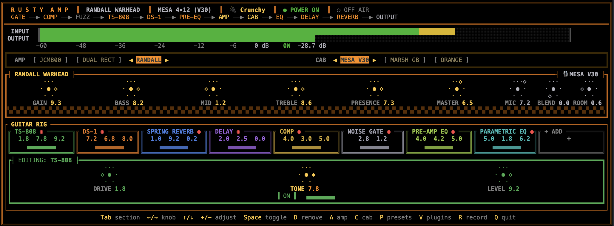

<header class="hero">
  

    
● POWER ON · ON AIR

    <h1>rusty-amp</h1>
    
a guitar amp &amp; pedalboard rig in your terminal

    

      Plug in your guitar, pick an amp, and play. rusty-amp recreates classic tube and
      solid-state amplifiers, a full board of stompbox effects, and multi-mic'd 4×12
      cabinets — all driven from a fast, keyboard-only interface with live metering.
      It ships with artist-inspired presets, so you can dial in a great tone in seconds.
    

    

      <a class="btn btn--primary" href="getting-started.html">▶ Get started</a>
      <a class="btn" href="https://github.com/danylokravchenko/rusty-amp/releases/latest">⬇ Download binary</a>
      <a class="btn" href="how-it-works.html">⚙ How it works</a>
    

    <figure class="shot">
      
<i></i><i></i><i></i>

      
    </figure>
  

</header>

<main class="wrap">

  <section>
    

      Signal chain
      

        <b>Guitar</b> → GATE → COMP
        → FUZZ → TS-808
        → DS-1 → PRE-EQ
        → <b>AMP</b> → <b>CAB</b>
        → EQ → DELAY
        → REVERB → <b>OUTPUT</b>
      

      

      

        Sample-by-sample DSP · 8× oversampled amp stages · partitioned-FFT cabinet convolution · true stereo out
      

    

  </section>

  <section>
    <h2>Highlights</h2>
    

      

🔊
<h3>3 amplifiers</h3>
Marshall JCM800, Mesa Dual Rectifier, and Randall Warhead — switchable while you play.

      

📦
<h3>3 cabinets + your IRs</h3>
Mesa, Marshall, and Orange 4×12s, each captured with three blendable mics. Load your own <code>.wav</code> IR and A/B it live.

      

🎛️
<h3>Full pedalboard</h3>
Gate, compressor, fuzz, Tube Screamer, DS-1, EQ, ping-pong delay, and stereo reverb. Add, remove, and bypass on the fly.

      

🎧
<h3>Studio-grade stereo</h3>
Wide, three-dimensional sound from the cab, delay, and reverb — a real L/R image, not a faked widener.

      

💾
<h3>Ready-made presets</h3>
Instant tones inspired by Metallica, Pantera, Slayer, Death, Slipknot, and more.

      

🔌
<h3>CLAP plugin host</h3>
Drop a third-party CLAP effect into the chain and tweak its parameters without leaving the TUI.

      

🎚️
<h3>AU amp host (macOS)</h3>
Load an Audio Unit amp sim — e.g. a Marshall plugin — as an amp-position override that replaces the built-in amp &amp; cab, and A/B it live.

      

🎵
<h3>Built-in tuner</h3>
Press <kbd>T</kbd> for a chromatic tuner with a ±cents needle and a live note spectrum.

      

⏺️
<h3>One-key recording</h3>
Capture the fully-processed signal straight to a stereo WAV file with a single keystroke.

      

🖥️
<h3>Cross-platform</h3>
Runs natively on macOS, Windows, and Linux via <a href="https://github.com/RustAudio/cpal">cpal</a>.

    

  </section>

  <section>
    <h2>Hear it</h2>
    
Nothing is better than a showcase! DI guitar track — no re-amping, no post-processing, straight out of rusty-amp.

    

      

        
Default toneMesa Dual Rectifier · Mesa V30

        
What you hear on first launch — stock knob positions, Tube Screamer, nothing else in the chain.

        <audio controls preload="none" src="assets/audio/default.wav"></audio>
      

      

        
Clean melodicMarshall JCM800 · Greenback

        
Warm glassy clean — gentle compression, edge-of-breakup gain, delay + hall reverb.

        <audio controls preload="none" src="assets/audio/clean_melodic.wav"></audio>
      

      

        
Solo seekerMesa Dual Rectifier · Mesa V30

        
Lead tone — sustain-focused, delay + reverb, on-axis mic for pick-attack clarity.

        <audio controls preload="none" src="assets/audio/solo_seeker.wav"></audio>
      

      

        
More coming soon

        
The other bundled presets are getting their own clips — check back.

      

    

    
<a class="btn" href="presets.html#bundled">All bundled presets →</a>

  </section>

  <section>
    <h2>The pedalboard</h2>
    
Eleven effects, each added, removed, and bypassed independently — the board shows only what you're using.

    

      

Noise Gate

Thresh · Release

Envelope-follower gate that silences hum and hiss between riffs.

      

Compressor

Sustain · Attack · Level

Hard-knee compressor with auto makeup — evens out picking, adds sustain.

      

Fuzz

Fuzz · Tone · Level

Big-Muff-style two-stage clipper with a scooped “wall of sound” voice.

      

TS-808

Drive · Tone · Level

The legendary Tube Screamer — asymmetric diode clip, mid-hump boost.

      

DS-1

Drive · Tone · Level

Aggressive cubic distortion with a bass↔treble tilt tone control.

      

Pre-amp EQ

Low · Mid · High

Shapes the signal <em>before</em> the amp clips — tighten the chug or push leads.

      

Parametric EQ

Low · Mid · High

Post-cabinet tone shaping of the final stereo mix.

      

Flanger

Rate · Depth · Feedback · Mix

LFO-swept comb filter — the classic metallic “jet plane” sweep, in stereo.

      

Chorus

Rate · Depth · Mix

LFO-swept long delay, no feedback — lush, watery thickening in stereo.

      

Delay

Time · Feedback · Mix

Stereo ping-pong — repeats bounce L↔R, up to 500 ms.

      

Stereo Reverb

Room · Damp · Mix

Dual decorrelated Freeverb cores for a wide, deep tail.

    

    
<a class="btn" href="pedals.html">Full pedal &amp; knob reference →</a>

  </section>

  <section>
    <h2>Amps &amp; cabinets</h2>
    

      

        3 amp models
        <ul class="clean">
          <li><b>Marshall JCM800</b> — punchy, dynamic, touch-sensitive · dual 12AX7, passive FMV tone stack, tube sag.</li>
          <li><b>Mesa Dual Rectifier</b> — compressed, aggressive, modern · triple gain stage, silicon sag.</li>
          <li><b>Randall Warhead</b> — tight, crushing, solid-state · FET→BJT→rail-clip, active tone stack.</li>
        </ul>
      

      

        3 cabinets + IR loader
        <ul class="clean">
          <li><b>Mesa 4×12 (V30)</b> — scooped, aggressive, forward-projecting.</li>
          <li><b>Marshall 4×12 (Greenback)</b> — warm, mid-forward, smooth top.</li>
          <li><b>Orange PPC412 (V30)</b> — thick, chunky, closed-back birch.</li>
          <li>Load any <code>.wav</code> impulse response and A/B against the built-ins with <kbd>X</kbd>.</li>
        </ul>
      

    

    
<a class="btn" href="amps-cabs.html">Amps, cabinets &amp; IRs →</a>

  </section>

  <section>
    <h2>Quick start</h2>
    
Pre-built binaries have presets baked in — nothing else to download.

    <pre data-lang="macOS · Apple Silicon"><code>curl -L https://github.com/danylokravchenko/rusty-amp/releases/latest/download/rusty-amp-macos-aarch64 -o rusty-amp
chmod +x rusty-amp
xattr -d com.apple.quarantine rusty-amp   # clear the unsigned-binary quarantine flag
./rusty-amp</code></pre>
    

      <a class="card" href="getting-started.html"><h3>① Install</h3>
Grab a binary or build from source.
</a>
      <a class="card" href="getting-started.html#startup"><h3>② Pick devices</h3>
Choose your interface, input channel, and output.
</a>
      <a class="card" href="presets.html"><h3>③ Load a preset</h3>
Press <kbd>P</kbd> and play.
</a>
    

  </section>

  

    
    <a class="next" href="getting-started.html">
      
Next →

      
Get started: install &amp; controls

    </a>
  

</main>
