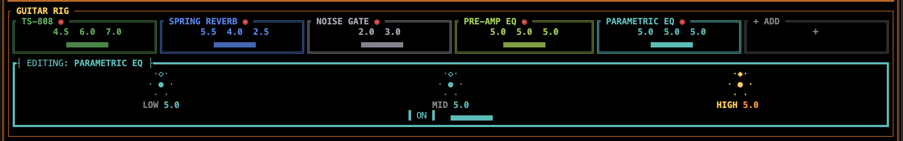

## The board (add / remove / bypass) {#board}

<figure class="shot">
  
<i></i><i></i><i></i>

  
</figure>

The **Guitar Rig** shows one compact tile per pedal that's on the board, followed by a `+ ADD` tile. <kbd>Tab</kbd> or <kbd>←</kbd>/<kbd>→</kbd> to a tile to load it into the full-size editor below — the editor takes on the pedal's livery colour. Only **enabled** pedals are on the board at startup; everything else lives in the picker.

| Key | Action |
| --- | ------ |
| <kbd>Enter</kbd> / <kbd>Space</kbd> (on `+ ADD`) | Open the picker listing pedals not on the board |
| <kbd>↑</kbd> / <kbd>↓</kbd> | Navigate the picker |
| <kbd>Enter</kbd> (in picker) | Add the selected pedal and jump focus to it |
| <kbd>Esc</kbd> | Close the picker |
| <kbd>D</kbd> (on a pedal) | Remove it from the board |
| <kbd>Space</kbd> (on a pedal) | Bypass / un-bypass it without removing it |

<b>Chain order is fixed</b> and follows the signal flow shown on the header ribbon:
Gate → Comp → Fuzz → TS-808 → DS-1 → Pre-EQ → <b>Amp</b> → <b>Cab</b> → Parametric EQ → Delay → Reverb.
Where a pedal sits in that order is part of its character — see <a href="how-it-works.html">How it works</a>.

## All pedals {#pedals}

Pick a pedal to load it into the editor — exactly like tabbing to its tile in the app. Every knob runs 0–10.

  

    <button class="tile is-active" style="--c:var(--gray)" role="tab" aria-selected="true" data-tab="gate">
      
Noise Gate

      
Thresh · Release

    </button>
    <button class="tile" style="--c:var(--gold)" role="tab" aria-selected="false" data-tab="comp">
      
Compressor

      
Sustain · Attack · Level

    </button>
    <button class="tile" style="--c:var(--magenta)" role="tab" aria-selected="false" data-tab="fuzz">
      
Fuzz

      
Fuzz · Tone · Level

    </button>
    <button class="tile" style="--c:var(--green)" role="tab" aria-selected="false" data-tab="ts">
      
TS-808

      
Drive · Tone · Level

    </button>
    <button class="tile" style="--c:#e08840" role="tab" aria-selected="false" data-tab="ds1">
      
DS-1

      
Drive · Tone · Level

    </button>
    <button class="tile" style="--c:var(--lime)" role="tab" aria-selected="false" data-tab="preeq">
      
Pre-amp EQ

      
Low · Mid · High

    </button>
    <button class="tile" style="--c:var(--teal)" role="tab" aria-selected="false" data-tab="peq">
      
Parametric EQ

      
Low · Mid · High

    </button>
    <button class="tile" style="--c:var(--purple)" role="tab" aria-selected="false" data-tab="delay">
      
Delay

      
Time · Feedback · Mix

    </button>
    <button class="tile" style="--c:var(--blue)" role="tab" aria-selected="false" data-tab="reverb">
      
Stereo Reverb

      
Room · Damp · Mix

    </button>
  

  

    
An envelope follower drives a smooth gain ramp (no clicks) that silences hum and string noise between phrases. Runs first so it cleans the rawest signal.

    
Thresh0–10 Gate open threshold. 0 = opens at very low levels (−80 dB), 10 = always open. Start around 2–3 for high-gain tones.

    
Release0–10 How long the gate stays open after the signal drops below threshold. Higher = slower, more natural decay.

  

  

    
Sits right after the gate, before the drive stages, so it evens out picking dynamics and adds sustain going into the amp — the classic “studio” upgrade for clean and edge-of-breakup tones. A peak-follower detector drives a hard-knee gain computer; auto makeup keeps the level steady as you add compression.

    
Sustain0–10 Compression amount — lowers the threshold (−6 dB → −40 dB) and raises the ratio (2:1 → 10:1). Higher = more squash and sustain.

    
Attack0–10 How fast the compressor clamps a transient (0.5 ms → 50 ms). Low = snappy/tight, high = lets the pick attack through.

    
Level0–10 Output makeup gain (≈0–2×). 5 = unity with auto makeup.

  

  

    
Big-Muff-style fuzz that runs first in the drive chain so it sees the rawest pickup signal. Two cascaded clipping stages give the long, singing sustain and near-square saturation of a vintage fuzz — much heavier than the TS or DS-1. The voice is mid-scooped at 700 Hz for the classic “wall of sound” timbre.

    
Fuzz0–10 Sustain/gain into the two cascaded soft-clip stages. High values drive the waveform toward a gated square wave.

    
Tone0–10 Low-pass after the scoop. 0 = dark/woolly (~400 Hz), 10 = bright/buzzy (~6 kHz).

    
Level0–10 Output volume of the pedal into the next stage.

  

  

    
The legendary mid-hump boost — asymmetric diode clipping that tightens the low end and pushes an amp into focused saturation. Great as a clean boost into an already-driven amp.

    
Drive0–10 Pre-clip gain (1×–51×). High values push the asymmetric diode clippers into saturation.

    
Tone0–10 Low-pass cutoff after clipping. 0 = dark (~500 Hz), 10 = bright (~7 kHz).

    
Level0–10 Output volume of the pedal into the next stage.

  

  

    
More aggressive than the TS, with a cubic clip stage and a seesaw “tilt” tone control that trades bass for treble around 1 kHz.

    
Drive0–10 Gain into the cubic clip stage (1×–61×). More aggressive than the TS.

    
Tone0–10 Tilt control (bass↔treble seesaw around ~1 kHz). 0 = dark &amp; full, 5 = flat, 10 = bright &amp; cutting.

    
Level0–10 Output volume of the pedal into the next stage.

  

  

    
Sits <b>before the amp</b>, so it shapes the signal that the gain stage actually clips — a different job from the post-cab Parametric EQ, which colours the final mix. Scoop the mids going in for a tighter chug, or push them for lead sustain. All three bands map 0–10 to −12 dB → 0 dB → +12 dB; centre (5.0) is flat.

    
Low100 Hz Low shelf.

    
Mid650 Hz Peak (Q 1.0).

    
High3 kHz High shelf.

  

  

    
Post-cabinet — shapes the final stereo tone after distortion. All three bands map 0–10 to −15 dB → 0 dB → +15 dB; centre (5.0) is unity gain.

    
Low120 Hz Low shelf.

    
Mid800 Hz Peak (Q 1.5).

    
High5 kHz High shelf.

  

  

    
Stereo ping-pong: feedback cross-feeds the two channels so repeats bounce left ↔ right.

    
Time0–10 Delay time 0–500 ms.

    
Feedback0–10 Repeat level. Capped at 85% internally to prevent runaway.

    
Mix0–10 Dry/wet blend.

  

  

    
Two decorrelated Freeverb cores (the right channel's delay lines are offset) produce a wide, deep stereo tail.

    
Room0–10 Decay time (Freeverb room size).

    
Damp0–10 High-frequency absorption in the feedback path.

    
Mix0–10 Dry/wet blend (0 = fully dry, 10 = fully wet).

  

