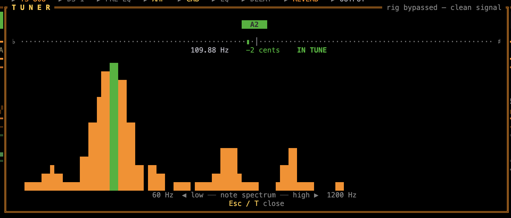

## Tuner (<kbd>T</kbd>) {#tuner}

<figure class="shot">
  
<i></i><i></i><i></i>

  
</figure>

Press <kbd>T</kbd> to open the chromatic tuner. While it's open the **entire rig is bypassed** — every pedal, the amp, and the cabinet are taken out of the path and the dry guitar passes straight to the output, so you hear (and tune against) a clean signal. Pitch is estimated with the McLeod normalised square-difference function (NSDF), accurate to a few cents.

The tuner shows:

- **The detected note** — large, with its octave (e.g. `E2`), green when in tune.
- **A ±cents needle** — `♭ ◄ … centre … ► ♯`. Left when flat, right when sharp; green within ±5 cents, amber within ±15, red beyond.
- **A verdict** — `IN TUNE`, `TUNE UP ▲` (flat), or `TUNE DOWN ▼` (sharp), plus the raw frequency in Hz.
- **A live note spectrum** — a log-spaced magnitude display from ~60 Hz to ~1.2 kHz, with the played fundamental highlighted.

Standard tuning reference:
<b>E2</b> 82.41 Hz · <b>A2</b> 110.00 · <b>D3</b> 146.83 · <b>G3</b> 196.00 · <b>B3</b> 246.94 · <b>E4</b> 329.63.
Press <kbd>Esc</kbd> / <kbd>T</kbd> to close and restore the full rig.

## Recording (<kbd>R</kbd>) {#recording}

Press <kbd>R</kbd> to start recording. The header switches from `○ OFF AIR` to a blinking `● ON AIR` indicator next to `POWER ON`. Press <kbd>R</kbd> again to stop — the file is written immediately and the saved path is shown briefly in the footer.

  
 POWER ON ○ OFF AIR

  

  
00:00

  
<button class="rec__btn">●Record</button>

  

<b>Interactive demo</b> — hit <em>Record</em> to see the on-air flow; nothing is captured here.

Recordings capture the fully-processed signal (after the entire effects chain and output limiter) as a 32-bit float **stereo** WAV at the same sample rate as your audio interface — the full multi-mic cab spread and stereo effects are preserved. Files are named `rusty-amp-<unix-timestamp>.wav` and saved to your home directory (`~/`).
